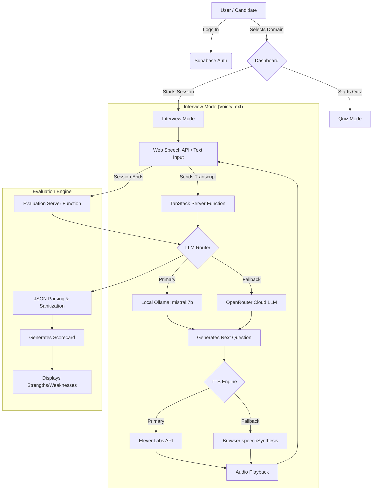

# IntervAI — AI-Powered Mock Interview Platform

An intelligent mock interview platform designed to help freshers prepare for technical placements across Data Structures & Algorithms (DSA), Spring Boot, System Design, and Low-Level Design (LLD).

## 🏆 Problem Statement (Hackathon T3)

> **Build an AI-powered mock interview tool that gives real-time feedback on answers for freshers preparing for placements.**

### The Problem
Freshers and college students often struggle with the pressure, pacing, and dynamic nature of real technical interviews. While there are countless resources to *learn* concepts (LeetCode, tutorials), there are very few accessible ways to *practice* speaking and articulating those concepts under interview conditions without relying on a human peer. 

### Our Solution
**IntervAI** bridges this gap by providing an end-to-end, voice-enabled AI interviewer. 
- **Dynamic Interviews:** The AI asks contextual questions, listens to the candidate's answers, acknowledges them, and dynamically moves to the next question—just like a real interviewer.
- **Detailed Evaluation:** After a 5-question session, it generates a comprehensive scorecard (Overall, Technical Depth, Communication, Problem Solving) with specific strengths, weaknesses, and actionable recommendations.
- **Hybrid Quizzes:** For quick knowledge checks, it offers instant multiple-choice quizzes with AI-judged free-form explanations for incorrect answers.
- **Local First:** Built to run locally using **Ollama** for zero-cost, high-privacy inference, with automatic fallback to cloud models (OpenRouter) if local models are unavailable.

---

## 🧠 What I Learned & Why It Matters

- **Prompt Engineering for Conversation:** Getting an LLM to act like a real interviewer (asking one question at a time, not revealing the answer, and maintaining a strict persona) required significant prompt tuning and context-window optimization.
- **Local AI Integration:** Integrating local LLMs via Ollama provides immense value for privacy and cost, but requires careful handling of context sizes (`num_ctx`) and output length caps (`num_predict`) to maintain responsive speeds on consumer hardware (e.g., GTX 1650).
- **Graceful Degradation:** Implementing offline browser-native Text-to-Speech (TTS) as a seamless fallback when cloud APIs (like ElevenLabs) hit rate limits ensures the app remains highly available and functional.
- **Why it Matters:** Democratizing interview practice gives every fresher an equal opportunity to build confidence and refine their communication skills before stepping into career-defining interviews.

---

## 📐 Architecture & Flowchart



---

## 🚀 Setup & Local Execution

### Prerequisites
1. **Node.js** (v18+ recommended)
2. **Ollama** installed locally ([Download](https://ollama.com/))
3. **Google Chrome / Microsoft Edge** (Required for Voice Input — Firefox does not support Web Speech API)

### 1. Start the Local AI (Ollama)
Pull the recommended model and start the server:
```bash
ollama run mistral:7b-instruct-q3_K_M
```
> Ensure no background systemd service is blocking port 11434. If it is, run:
> `sudo systemctl stop ollama && ollama serve`

### 2. Configure Environment
Create a `.env` file in the root directory:
```env
# Optional: For cloud fallback
OPENROUTER_API_KEY="your-openrouter-key"

# Optional: For high-quality voice (requires credits)
ELEVENLABS_API_KEY="your-elevenlabs-key"
```
*(Note: You can also input your ElevenLabs key directly in the app's Settings Modal!)*

### 3. Install & Run
```bash
npm install
npm run dev
```
Open `http://localhost:8080` in Chrome/Edge.
